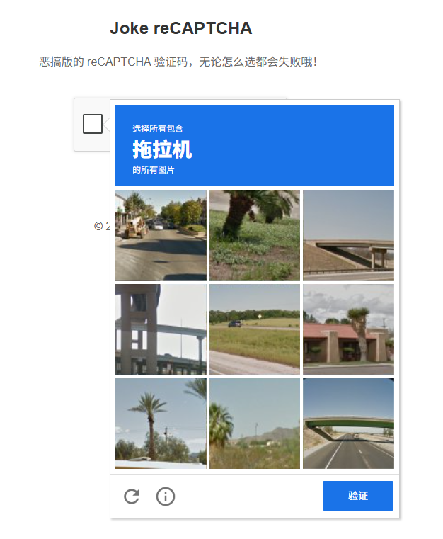

# Fake reCAPTCHA

恶搞版的 reCAPTCHA 验证码，无论怎么选都会失败。

## 项目简介

这是一个恶搞版的 reCAPTCHA 验证码组件，完全模仿 Google reCAPTCHA 的外观和交互，但无论用户如何选择，都会显示验证失败。



## 特性

- 完全模仿 Google reCAPTCHA 的界面
- 随机生成物体名称和验证码图片
- 响应式设计，适配不同屏幕尺寸
- 无论怎么选择，都会验证失败

## 技术栈

- Vue 3 + TypeScript
- Vite
- pnpm

## 安装

```bash
# 克隆项目
git clone https://github.com/Steven-Qiang/fake-recaptcha.git

# 进入项目目录
cd fake-recaptcha

# 安装依赖
pnpm install
```

## 开发

```bash
# 启动开发服务器
pnpm run dev

# 构建生产版本
pnpm run build

# 预览生产构建
pnpm run preview
```

## 使用

### 在 Vue 项目中使用

1. 导入 Captcha 组件
2. 在模板中使用

```vue
<template>
  <div>
    <h1>Fake reCAPTCHA</h1>
    <captcha />
  </div>
</template>

<script setup lang="ts">
  import Captcha from './components/Captcha.vue';
</script>
```

## 工具包 (Toolkit)

### 简介

Toolkit 目录包含一个用于抓取 reCAPTCHA 验证码图片的爬虫工具。该工具使用 Playwright 自动化浏览器，访问 Google
reCAPTCHA 演示页面，自动点击刷新按钮并抓取 payload 图片。

### 功能

- 自动访问 reCAPTCHA 演示页面
- 识别并进入 reCAPTCHA iframe
- 自动点击刷新按钮获取新的验证码图片
- 监听网络请求，抓取 payload 图片
- 将抓取的图片保存到 toolkit/payload 目录
- 无限循环运行，持续抓取图片

### 使用方法

1. 进入 toolkit 目录
2. 安装依赖
3. 运行爬虫

```bash
# 进入 toolkit 目录
cd toolkit

# 安装依赖
pnpm install

# 安装 Playwright 浏览器
npx playwright install

# 运行爬虫
node crawler.js
```

### 注意事项

- 爬虫会无限循环运行，直到手动停止
- 抓取的图片会保存在 toolkit/payload 目录
- 请合理使用该工具，不要过度请求 Google 服务器

## 项目结构

```
fake-recaptcha/
├── src/
│   ├── assets/            # 静态资源
│   │   ├── icon/          # 图标
│   │   ├── payload/       # 验证码图片
│   │   └── styles__ltr.css # 样式文件
│   ├── components/        # 组件
│   │   └── Captcha.vue    # 核心验证码组件
│   ├── App.vue            # 主应用组件
│   └── main.ts            # 应用入口
├── toolkit/               # 工具目录
│   ├── package.json       # 工具包配置
│   └── crawler.js         # reCAPTCHA 图片爬虫
├── .github/               # GitHub 配置
│   └── workflows/         # GitHub Actions 工作流
│       └── deploy.yml     # 部署到 GitHub Pages 的工作流
├── dist/                  # 构建输出目录
├── package.json           # 项目配置
├── vite.config.ts         # Vite 配置
├── tsconfig.json          # TypeScript 配置
└── README.md              # 项目说明
```
